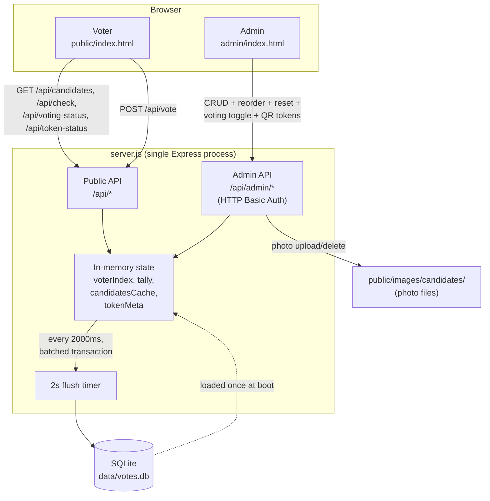
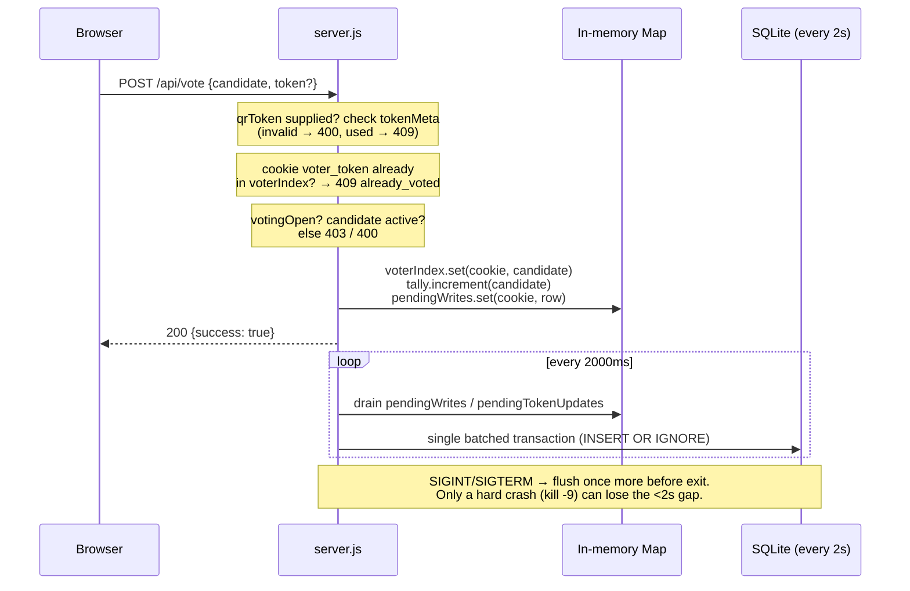
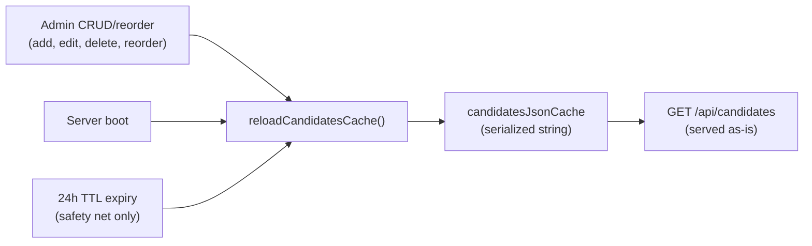

# Architecture

This complements `README.md` (which covers *what* the API/admin/deployment
do) with *how the pieces fit together*. Start with `../CLAUDE.md` for a
quick orientation, and note it up front there: **this app is unrelated to
the Next.js/Prisma/Redis system described in the repo-root `CLAUDE.md`.**
It's a standalone Express + SQLite server for one match's voting page.

## Component map

## Vote request lifecycle

A vote never blocks on disk. This is what makes ~1000 concurrent votes safe:

Two independent gates run before a vote is accepted, in this order:

1. **QR token gate** (only if `?t=` / body `token` is present) — token must
   exist and be unused, checked against `tokenMeta`.
2. **Per-browser gate** (always) — the `voter_token` cookie must not already
   be in `voterIndex`.

Both must pass; they're deliberately redundant ("defense in depth" per the
comment in `server.js`) so a token doesn't become a way to vote twice in
the same browser, and a cleared cookie doesn't let a used QR code be reused.

## Candidate list caching

`GET /api/candidates` never recomputes on request — it returns a
pre-serialized JSON string:

The 24h TTL is a safety net for out-of-band DB changes, not the normal
invalidation path — every admin mutation invalidates it immediately.

## Static asset cache-busting

`/` and every candidate photo URL are versioned with `?v=<file mtime>` so
that replacing a file on disk (new logo, swapped candidate photo) is picked
up by every visitor immediately, while unchanged files stay cached for 30
days as `immutable`.

- Fixed assets (logo, background, fonts, etc.): listed explicitly in
  `STATIC_IMAGE_VERSION_TARGETS` in `server.js`. `/` is rendered dynamically
  via `renderVersionedHtml` specifically to inject these — it is *not*
  served through `express.static`.
- Candidate photos: versioned per-request via `candidatePhotoUrl`, driven
  by the same file-mtime trick, no manual list needed.
- `.html` responses are always `Cache-Control: no-cache` so the versioned
  URLs themselves never go stale in a cached page shell.

**Gotcha**: adding a new fixed image/font to `public/` and referencing it
from `index.html` is not enough — it must also be added to
`STATIC_IMAGE_VERSION_TARGETS`, or it will silently skip cache-busting.

## QR single-use tokens

A layer independent of, and stacked on top of, the cookie-based vote gate:

- Batches (`token_batches`) group tokens generated together with an
  optional label; individual tokens (`vote_tokens`) belong to a batch.
- `tokenMeta` (in-memory) mirrors `vote_tokens` for the same reason votes
  are in-memory-first: marking a token used must be instant and safe under
  concurrent scans, with the same 2s-batched flush to SQLite.
- A batch can only be deleted while none of its tokens have been used —
  this protects the audit trail once any of them cast a real vote.
  Individual tokens can also be deleted one at a time (`DELETE
  /api/admin/tokens/:token`, admin → QR tab → "Voir les QR"), same rule:
  blocked once that specific token has been used. Because tokens can now
  disappear independently of the batch, `GET /api/admin/tokens/batches`
  computes each batch's `count` live from `tokenMeta` rather than trusting
  the original `token_batches.count` column, so totals stay accurate after
  individual deletions.
- Without a token (bare `/` URL), behavior is unchanged: open voting,
  cookie-only protection. Tokens are additive, not a replacement.

## Things intentionally not built here

These come up naturally when comparing this app to the root repo's
tournament spec — they are out of scope for this codebase, not oversights:

- No multi-match bracket, no survivor carry-forward between matches — one
  deployment models one match; see "Reusing this page" in `README.md`.
- No realtime push to the audience/bigscreen (no SSE/WebSockets) — the
  client fetches state once on page load only.
- No roles/permissions beyond the single shared admin Basic Auth login.
- No automatic tie-breaking — the admin resolves ties by reading the
  results table.
